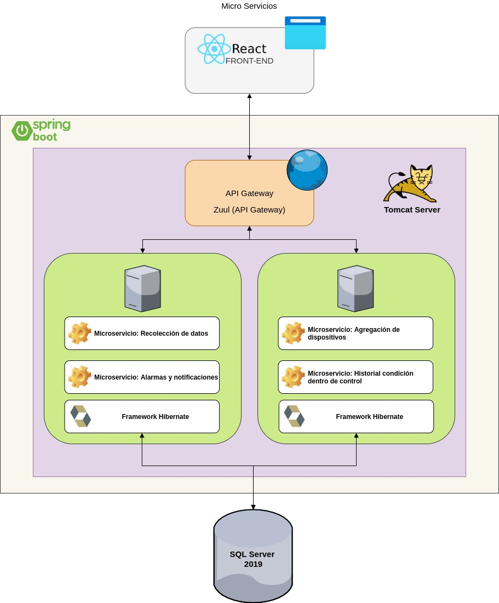
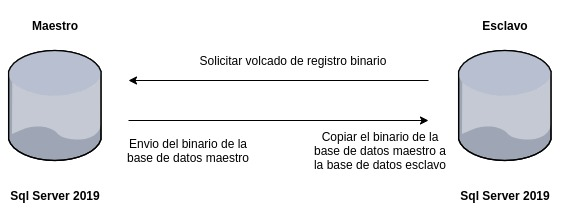

# Introducción

## :trophy: A2.3 Actividad de aprendizaje

- Patrones de arquitectura de software

### :blue_book: Instrucciones

 - Tomando como base la documentación estilos y patrones de arquitectura de software, elabore la arquitectura del sistema para el caso de estudio.
 - Toda actividad o reto se deberá realizar utilizando el estilo **MarkDown con extension .md** y el entorno de desarrollo VSCode, debiendo ser elaborado como un documento **single page**, es decir si el documento cuanta con imágenes, enlaces o cualquier documento externo debe ser accedido desde etiquetas y enlaces, y debe ser nombrado con la nomenclatura **A2.3_NombreApellido_Equipo.pdf.**
- Es requisito que el .MD contenga una etiqueta del enlace al repositorio de su documento en GITHUB, por ejemplo **Enlace a mi GitHub** y al concluir el reto se deberá subir a github.
- Desde el archivo **.md** exporte un archivo **.pdf** que deberá subirse a classroom dentro de su apartado correspondiente, sirviendo como evidencia de su entrega, ya que siendo la plataforma **oficial** aquí se recibirá la calificación de su actividad.
- Considerando que el archivo .PDF, el cual fue obtenido desde archivo .MD, ambos deben ser idénticos.
- Su repositorio ademas de que debe contar con un archivo **readme**.md dentro de su directorio raíz, con la información como datos del estudiante, equipo de trabajo, materia, carrera, datos del asesor, e incluso logotipo o imágenes, debe tener un apartado de contenidos o indice, los cuales realmente son ligas o **enlaces a sus documentos .md**, _evite utilizar texto_ para indicar enlaces internos o externo.
- Se propone una estructura tal como esta indicada abajo, sin embargo puede utilizarse cualquier otra que le apoye para organizar su repositorio.

``` 
| readme.md
| | blog
| | | C2.1_NombredelaActividad.md
| | | C2.2_NombredelaActividad.md
| | | C2.3_NombredelaActividad.md
| | img
| | docs
| | | A2.1_NombredelaActividad.md
| | | A2.2_NombredelaActividad.md
| | | A2.3_NombredelaActividad.md
```
___

### :pencil2: Desarrollo

1. Considere aplicar al caso de estudio los siguientes patrones de arquitectura
   
   - [ ] Patrón de arquitectura cliente-servidor
   - [ ] Patrón de arquitectura en Capas
   - [ ] Patrón de arquitectura Modelo vista controlador
   - [ ] Patrón de arquitectura orientada a micro-servicios
   - [ ] Patrón de arquitectura Tuberías y filtros
   - [ ] Patrón de arquitectura basado en eventos
   - [ ] Patrón de arquitectura repositorio o pizarra
   - [ ] Patrón de arquitectura publicador/suscriptor
   - [ ] Patrón de arquitectura maestro-esclavo
   - [ ] Patrón de arquitectura punto a punto

2. Tómese como base las vistas arquitectónicas asi como los diagramas UML elaborados, para aplicar el patrón que considere el mas apropiado para cada uno de los siguientes escenarios.
   
- 2.1 Considerando que se desea **mantener y escalar el sistema**, se busca desarrollar la aplicación a través de la descomposición de pequeños servicios independientes y aislados, los cuales consuman una interface externa para comunicarse a un servidor de base de datos.
-   [x] Patrón de arquitectura orientada a micro-servicios

<p align="center">

</p>


- 2.2 Siendo la **confidencialidad y la seguridad** atributos o requerimientos para el caso de estudio, se busca estructurar cada uno de los componentes que se van a programar en grupos de sub-tareas, donde cada una de estas sub-tareas se deberá comunicar una capa intermedia y esta a otra capa superior.
-   [x] Patrón de arquitectura en capas


- 2.3 Buscando la **disponibilidad** del sistema se plantea instalar dos servidores de servicios, donde estos realicen sus peticiones a un tercer servidor en el cual se almacenaría la base de datos

-   [x] Patrón de arquitectura cliente-servidor
<p align="center">

</p>


- 2.4 Identificando que la **integridad** de los datos es un requisito,  se plantea replicar y sincronizar la base de datos almacenada dentro del servidor principal a otro, considerando el principal como maestro y secundario como esclavo.

-   [x] Patrón de arquitectura maestro-esclavo
<p align="center">

</p>

- 2.5 Considerando que el cliente solicito que cada vez que ocurra una falla se deberá proporcionar **alarmas** a los distintos usuario independiente del lugar en que se encuentren, se observa que se deberá contratar un proveedor de servicios para disparar las alarmas y estas lleguen a los usuarios requeridos.

-   [x] Patrón de arquitectura cliente-servidor


___   
### :exclamation: Conclusiones

La realización de la actividad hizo que pudiera aplicar la arquitectura que mejor encaje con algún caso de uso que se plantee en el desarrollo de un sistema, el poder proyectar de manera gráfica lo que se quiere hacer y entender lo que se quiere lograr sin entrar a fondo en la documentación con solo ver una imagen de la arquitectura.

**Cristian Escobedo**

Al llevar a cabo la realización de los diagramas para ciertas situaciones, nos ayudó a entender más fácilmente el tipo de arquitecturas que debemos utilizar dependiendo la situación que se nos presenta, con esto nos preparamos un poco más para ubicar la arquitectura del proyecto que estamos desarrollando.

**Tania Osuna**

La actividad tuvo como propósito incorporar un patrón de arquitectura con base a una necesidad específica. El desarrollo de un diagrama como apoyo para un planteamiento de cómo se visualiza la implementación de un patrón en un caso en específico fue bastante útil para dar forma y orden a la idea formulada.

**Jorge Durán**

___   
### :bomb: Rubrica

| Criterios     | Descripción                                                                                  | Puntaje |
| ------------- | -------------------------------------------------------------------------------------------- | ------- |
| Instrucciones | Se cumple con cada uno de los puntos indicados dentro del apartado Instrucciones?            | 10      |  | 5 |
| Desarrollo    | Se respondió a cada uno de los puntos solicitados dentro del desarrollo de la actividad?     | 60      |
| Demostración  | El alumno se presenta durante la explicación de la funcionalidad de la actividad?            | 20      |
| Conclusiones  | Se incluye una opinión personal de la actividad  por cada uno de los integrantes del equipo? | 10      |

:house: [Ir a especificación de requisitos](../docs/D2.0_Especificacion_requisitos_y_diseno.md)
